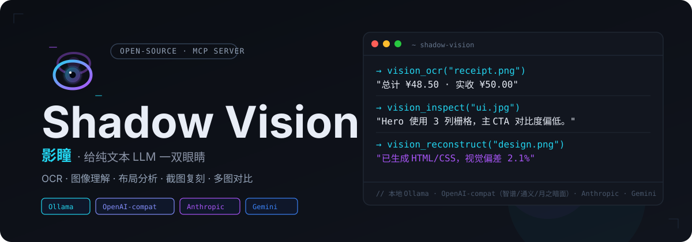
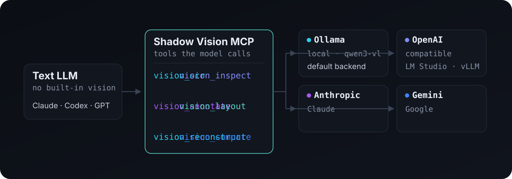

<p align="center">
  
</p>

# 影瞳 · Shadow Vision

给纯文本 LLM 添加一双眼睛。影瞳是一个开源 MCP 视觉服务，让 AI Agent 通过 `vision_ocr` 与 `vision_inspect` 看见、理解并分析真实世界的信息，无需切换宿主文本模型。

## 为什么不同

- **MCP 原生**：适配 Codex、Claude Desktop、Cursor 及其他 MCP 客户端
- **可插拔后端**：Ollama、OpenAI-compatible、Anthropic、Gemini
- **本地优先**：使用 Ollama 时图片和推理都可以留在本机
- **输入简单**：支持本地文件路径或 base64 图片数据

## 工作原理

<p align="center">
  
</p>

文本模型通过 MCP 调用影瞳的两个工具，影瞳把图片和提示词转发到配置的视觉后端，再把文字结果返回给模型。

## 快速开始

### 1. 安装

需要 Python 3.11+ 与 [uv](https://docs.astral.sh/uv/)：

```bash
git clone https://github.com/WardLu/shadow-vision.git
cd shadow-vision
uv sync
```

### 2. 使用本地 Ollama（推荐新手）

先安装 [Ollama](https://ollama.com/download)。如果没有使用 Ollama 桌面应用，可手动启动服务：

```bash
ollama serve
ollama pull qwen3-vl:2b
ollama list
```

`qwen3-vl:2b` 是默认视觉模型。也可以把 `VISION_MODEL` 换成 `ollama list` 中其他已经下载的视觉模型；文本模型不能直接完成看图。

### 3. 注册为 MCP 服务

Codex 可以直接执行：

```bash
codex mcp add vision -- uv run vision-mcp
```

或者写入 `~/.codex/config.toml`：

```toml
[mcp_servers.vision]
type = "stdio"
command = "uv"
args = ["run", "vision-mcp"]
cwd = "/path/to/shadow-vision"
env = { VISION_BACKEND = "ollama", VISION_MODEL = "qwen3-vl:2b", OLLAMA_URL = "http://127.0.0.1:11434/api/chat" }
```

重启 MCP 客户端后，直接让模型“看一下这张图片”即可。

## 切换模型和后端

`VISION_BACKEND` 决定调用方式，`VISION_MODEL` 决定具体视觉模型。修改 MCP 配置中的环境变量后，重启客户端即可。

切换本地模型：

```toml
env = { VISION_BACKEND = "ollama", VISION_MODEL = "你已下载的视觉模型", OLLAMA_URL = "http://127.0.0.1:11434/api/chat" }
```

切换到 OpenAI-compatible 服务：

```toml
env = { VISION_BACKEND = "openai_compatible", VISION_MODEL = "服务端提供的视觉模型名", OPENAI_API_BASE = "https://api.example.com/v1", OPENAI_API_KEY = "sk-...", OPENAI_MAX_TOKENS = "1024", OPENAI_MAX_TOKENS_FIELD = "max_tokens" }
```

`OPENAI_*` 表示 OpenAI Chat Completions 兼容协议，也适用于 LM Studio、vLLM 和其他提供 `/v1/chat/completions` 的服务。

## 配置后端

### 通用变量

| 变量 | 默认值 | 说明 |
|---|---|---|
| `VISION_BACKEND` | `ollama` | `ollama` / `openai_compatible` / `anthropic` / `gemini` |
| `VISION_MODEL` | `qwen3-vl:2b` | 视觉模型名称 |
| `VISION_TIMEOUT` | `180` | 请求超时（秒） |

### Ollama

| 变量 | 默认值 | 说明 |
|---|---|---|
| `OLLAMA_URL` | `http://127.0.0.1:11434/api/chat` | Ollama 对话端点 |

使用前执行 `ollama pull <视觉模型名>` 下载模型。

### OpenAI-compatible

| 变量 | 默认值 | 说明 |
|---|---|---|
| `OPENAI_API_BASE` | `http://127.0.0.1:11434/v1` | 兼容服务基础地址 |
| `OPENAI_API_KEY` | 空 | 本地服务通常可留空 |
| `OPENAI_MAX_TOKENS` | 未设置 | 可选输出 token 上限；未设置时不发送 token 限制字段 |
| `OPENAI_MAX_TOKENS_FIELD` | `max_tokens` | 可选：`max_tokens` 或 `max_completion_tokens` |

不同服务支持的 token 字段不完全一致：支持旧字段就使用 `max_tokens`，只支持新版字段就改成 `max_completion_tokens`，两个字段都不接受时不要设置 `OPENAI_MAX_TOKENS`。旧变量名 `VISION_API_BASE`、`VISION_API_KEY`、`VISION_MAX_TOKENS` 和 `VISION_MAX_TOKENS_FIELD` 仍兼容。

### Anthropic / Gemini

```bash
VISION_BACKEND=anthropic ANTHROPIC_API_KEY=sk-ant-... VISION_MODEL=your-claude-vision-model uv run vision-mcp
VISION_BACKEND=gemini GEMINI_API_KEY=AIza... VISION_MODEL=your-gemini-vision-model uv run vision-mcp
```

Anthropic 还支持 `ANTHROPIC_BASE_URL`、`ANTHROPIC_VERSION` 和 `ANTHROPIC_MAX_TOKENS`；Gemini 还支持 `GEMINI_BASE_URL` 和 `GEMINI_MAX_TOKENS`。

## 工具

### `vision_ocr`

从截图、票据、文档或表格中提取文字：

```python
vision_ocr(image_path="/tmp/receipt.png")
```

### `vision_inspect`

描述图片，或回答关于图片的问题：

```python
vision_inspect(image_path="/tmp/design.png", question="List any UI bugs you see.")
```

两个工具都支持：

- `image_path`：服务器可读的本地图片路径
- `image_base64` + `mime_type`：base64 编码的图片数据

## 本地模型选择与测评

Ollama 模型页可以查看模型包大小、上下文窗口和图像能力，但模型包大小不是最低内存要求。建议从 `qwen3-vl:2b` 开始；如果 OCR 或复杂图表理解不足，再比较 `qwen3-vl:4b`、`qwen3-vl:8b` 或文档 OCR 取向的 `minicpm-v4.5:q4_0`。

准备 3–5 张真实图片，覆盖 OCR、截图、图表和困难样本，并使用相同提示词比较模型：

```bash
MODEL=qwen3-vl:2b
IMAGE=/absolute/path/to/test.png

time ollama run "$MODEL" "$IMAGE" "请准确抄录图片中的全部文字，只输出文字。"
time ollama run "$MODEL" "$IMAGE" "请描述图片内容，并列出你不确定的地方。"
```

记录 OCR 错误数量、关键对象和关系是否正确、幻觉、完整响应延迟，以及 `ollama ps` 中的 processor 状态。先直接测试 Ollama，再通过 `vision_ocr` / `vision_inspect` 测试 MCP 链路，可以区分模型问题和 MCP 配置问题。

推荐资料：

- [Ollama Vision 文档](https://docs.ollama.com/capabilities/vision)
- [Ollama Qwen3-VL 模型页](https://ollama.com/library/qwen3-vl)
- [Qwen3-VL 官方仓库](https://github.com/QwenLM/Qwen3-VL)
- [MiniCPM-V 4.5 官方评测](https://github.com/OpenBMB/MiniCPM-V/blob/main/docs/minicpm_v4dot5_en.md)
- [Ollama Context Length 文档](https://docs.ollama.com/context-length)
- [Ollama Modelfile 参数文档](https://docs.ollama.com/modelfile)

## 支持的 Agent

所有 Agent 都启动同一命令：`uv run vision-mcp`。

| Agent | 配置文件 |
|---|---|
| Codex | `~/.codex/config.toml` |
| Claude Code | `.mcp.json` |
| Cursor | `.cursor/mcp.json` |
| VS Code Copilot | `.vscode/mcp.json` |
| Windsurf | `.windsurf/mcp_config.json` |
| Claude Desktop | `claude_desktop_config.json` |
| OpenCode | `opencode.json` |

## 开发

```bash
uv sync
uv run python -c "import vision_mcp.server; print('ok')"
python -m unittest discover -s tests -v
```

## 联系我

如果你对 B 端产品、AI 产品开发、供应链数字化或 Shadow 系列产品感兴趣，可以联系我：

- **X（Twitter）**：[@Gollumgulu](https://x.com/Gollumgulu)
- **小红书 / 微博 / 抖音**：全网同名「Ward 的 AI 产品实战」—— [小红书](https://xhslink.cn/m/4W1NWyRrxv5) · [微博](https://weibo.com/u/8344390431) · [抖音](https://v.douyin.com/1y06PMohfoE/)
- **产品主页**：[Shadow Nexus](https://www.shadow.wang/)
- **Email**：[wardlu@126.com](mailto:wardlu@126.com)

> 可接 1v1 咨询和项目陪跑：产品诊断 · AI 实施 · 工作流 / Skill · 系统定制

## License

MIT
